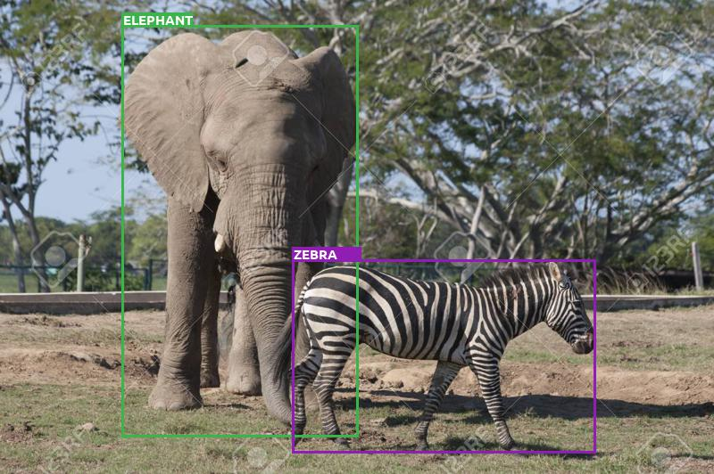
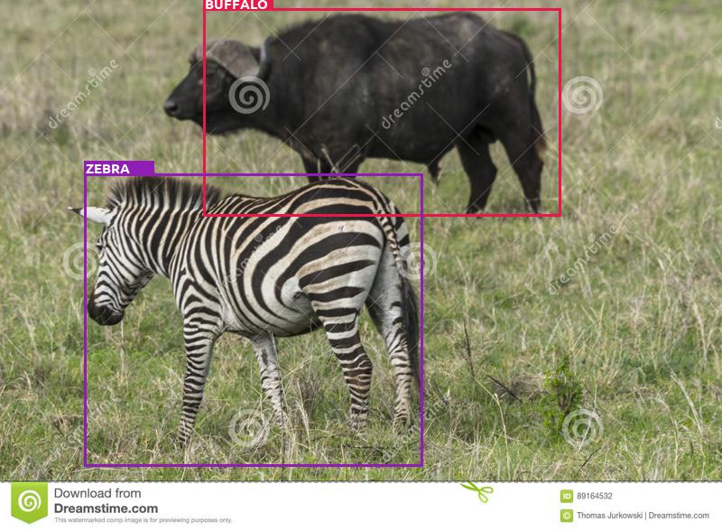
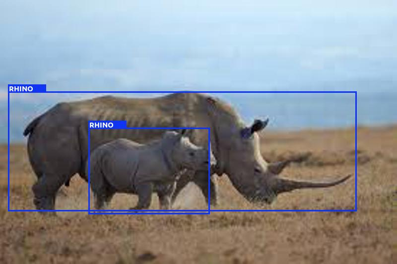
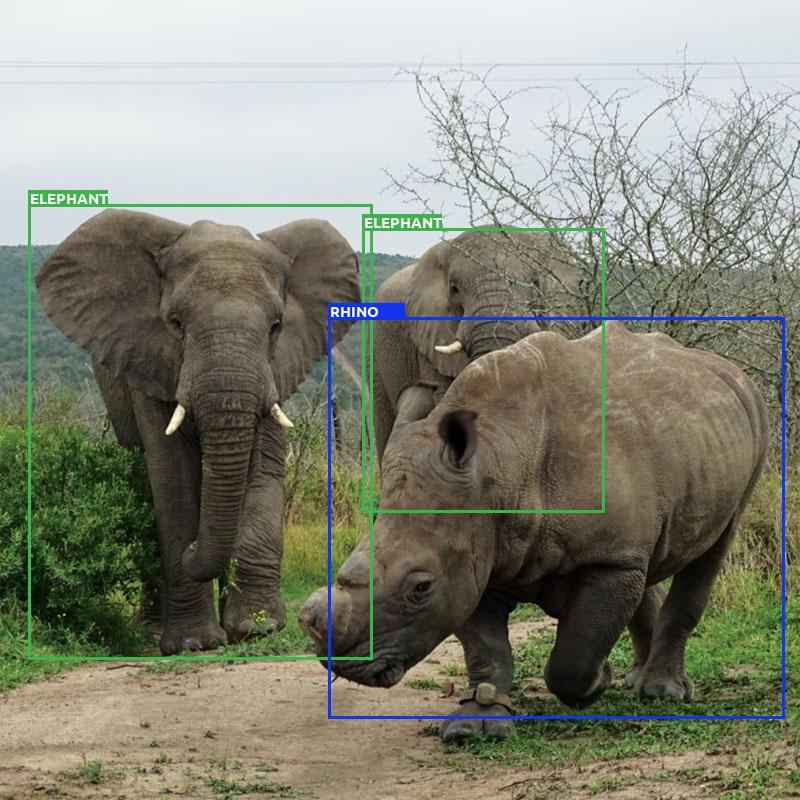

# SSD pytorch
## General
This is a simple pytorch implementation for SSD for object detection.

### Dataset
The model was trained using the [African Wildlife Dataset](https://www.kaggle.com/biancaferreira/african-wildlife).
The annotation.txt file is created as:
```
python annotation.py
```
which stores the image and its metadata file addresses:
```
data/AfricanWildlife/rhino/347.jpg	data/AfricanWildlife/rhino/347.txt
data/AfricanWildlife/rhino/066.jpg	data/AfricanWildlife/rhino/066.txt
data/AfricanWildlife/rhino/146.jpg	data/AfricanWildlife/rhino/146.txt
data/AfricanWildlife/rhino/233.jpg	data/AfricanWildlife/rhino/233.txt
data/AfricanWildlife/rhino/345.jpg	data/AfricanWildlife/rhino/345.txt
data/AfricanWildlife/rhino/278.jpg	data/AfricanWildlife/rhino/278.txt
data/AfricanWildlife/rhino/342.jpg	data/AfricanWildlife/rhino/342.txt
data/AfricanWildlife/rhino/242.jpg	data/AfricanWildlife/rhino/242.txt
data/AfricanWildlife/rhino/043.jpg	data/AfricanWildlife/rhino/043.txt
data/AfricanWildlife/rhino/126.jpg	data/AfricanWildlife/rhino/126.txt
```
### Training and Predicting
```
python train.py
```
```
python predict_wildlife.py
```
### Some results



